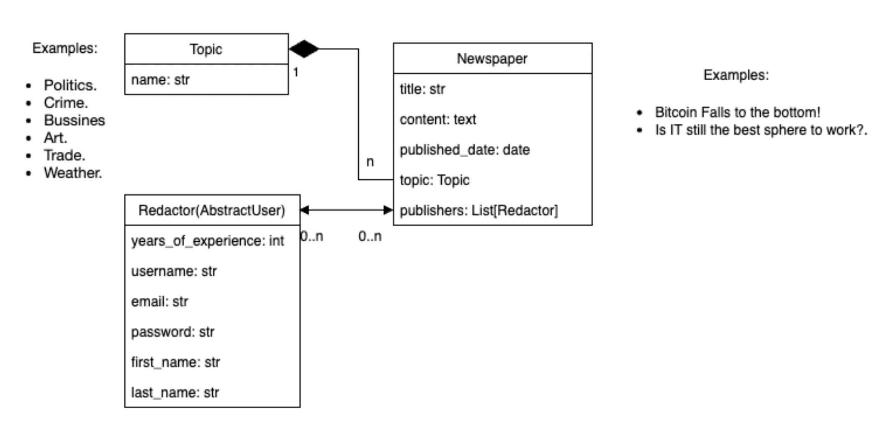

# newspaper-agency
A system for monitoring and tracking news agency editors responsible for publishing a newspaper

DB structure:

# Implementation 

- General access to the index page
- Access for registered users to internal pages
---

**Inside:**
- Topic list page
- Editors list page (ability to add a new editor, change work experience, delete an editor)
- Individual editor page with a list of his publications (ability to change work experience, delete an editor)
- Newspaper list page: issue date, topic, newspaper name (ability to add a new newspaper, delete or edit an existing one)
- Single newspaper page: full information about the newspaper as well as its content (ability to edit or delete)